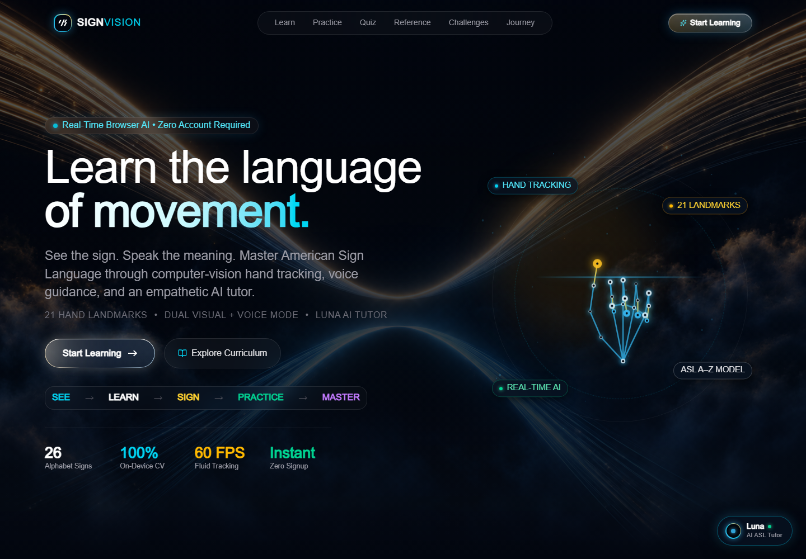
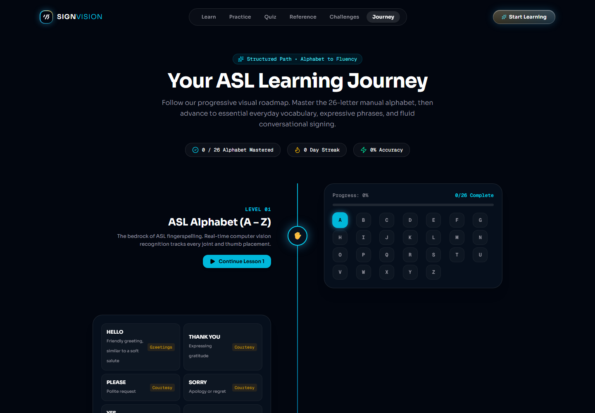
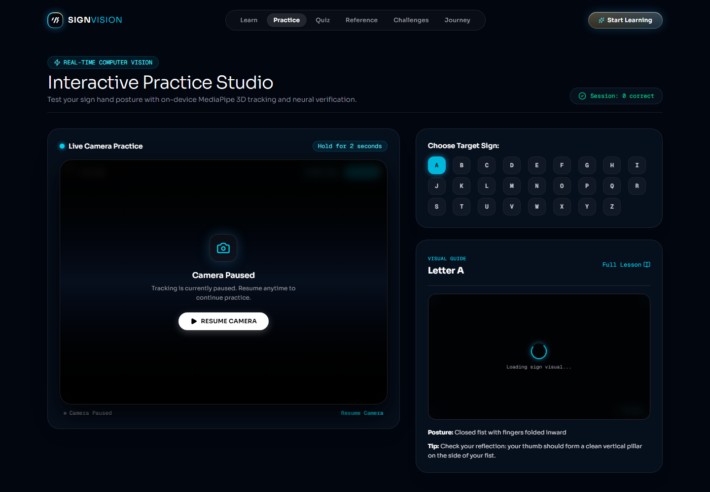
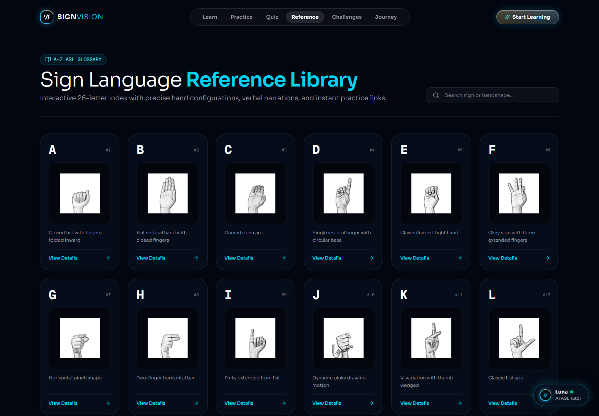

# SignVision — ASL Learning Platform

An accessible, browser-first learning platform for practicing American Sign Language (ASL). SignVision combines guided lessons, a visual reference library, real-time hand tracking, quizzes, and an AI learning companion in one responsive experience.

[](https://nextjs.org/)
[](https://fastapi.tiangolo.com/)
[](https://www.typescriptlang.org/)
[](https://vercel.com/)

## Highlights

- Learn ASL alphabet, words, numbers, and phrases with curated visual references.
- Practice signs with live webcam landmark detection and on-device ONNX inference.
- Build momentum through guided lessons, quizzes, timed challenges, and a progress dashboard.
- Ask Luna, the built-in learning companion, for lesson help and approachable explanations.
- Keep the experience private by running the primary recognition loop in the browser.

## Screenshots

| Home | Learning journey |
| --- | --- |
|  |  |

| Practice | Reference guide |
| --- | --- |
|  |  |

## How it works

```text
Webcam → MediaPipe Hands → 21 landmarks → ONNX Runtime Web → sign prediction
                                      ↓
                              lessons & progress API → Supabase
```

The recognition pipeline runs client-side with MediaPipe Hands and ONNX Runtime Web. The FastAPI service provides lessons, progress, optional server-side hand analysis, and Luna AI endpoints.

## Tech stack

| Area | Tools |
| --- | --- |
| Web app | Next.js 16, React 19, TypeScript, Tailwind CSS |
| Sign recognition | MediaPipe Hands, ONNX Runtime Web, WebGL |
| API | FastAPI, Uvicorn, SQLAlchemy |
| Data & auth | Supabase PostgreSQL and Auth |
| Deployment | Vercel (frontend and backend) |

## Run locally

### Frontend

```bash
cd frontend
cp .env.example .env.local
npm install
npm run dev
```

Open [http://localhost:3000](http://localhost:3000).

### Backend

```bash
cd backend
cp .env.example .env
pip install -r requirements.txt
uvicorn main:app --reload --port 8000
```

The API documentation is available at [http://localhost:8000/docs](http://localhost:8000/docs).

## Environment variables

| Variable | Used by | Purpose |
| --- | --- | --- |
| `NEXT_PUBLIC_API_URL` | frontend | Public URL of the deployed FastAPI service |
| `NEXT_PUBLIC_SUPABASE_URL` | frontend | Supabase project URL |
| `NEXT_PUBLIC_SUPABASE_ANON_KEY` | frontend | Supabase public anonymous key |
| `FRONTEND_URL` | backend | Deployed frontend URL for CORS; use commas for multiple origins |
| `SUPABASE_URL` / `SUPABASE_KEY` | backend | Supabase server configuration |
| `GROQ_API_KEY` | backend | Optional Luna AI provider key |

Never commit real environment values. Use the provided `.env.example` files as templates.

## Deploy on Vercel

Deploy as two Vercel projects from this repository:

1. **Backend** — Import the repository, set **Root Directory** to `backend`, and deploy. Add `FRONTEND_URL` after the frontend URL is known, along with any Supabase and optional AI variables.
2. **Frontend** — Import the same repository a second time, set **Root Directory** to `frontend`, and deploy. Set `NEXT_PUBLIC_API_URL` to the backend deployment URL and add the Supabase public values.
3. Update the backend's `FRONTEND_URL` with the frontend deployment URL, then redeploy the backend.

`backend/vercel.json` routes all backend requests to the FastAPI entry point, including `/health` and `/api/*`.

## API at a glance

| Route | Purpose |
| --- | --- |
| `GET /health` | Service health and enabled modules |
| `GET /api/lessons/` | Lesson catalogue |
| `GET /api/lessons/{id}` | One lesson |
| `GET /api/progress/user/{user_id}` | Learner progress |
| `POST /api/progress/` | Store letter progress |
| `POST /api/recognition/*` | Recognition feedback |
| `POST /api/ai/*` | Luna tutoring support |

## Project structure

```text
frontend/             Next.js application and browser-side recognition
backend/              FastAPI service, database code, and ML utilities
backend/api/index.py  Vercel serverless entry point
```

## License

This project is provided for learning and demonstration purposes.
